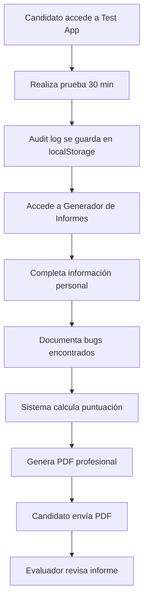

# 🎯 Generador de Informe Técnico - AIQUAA Labs

## Resumen Ejecutivo

Se ha creado exitosamente una **herramienta completa de generación de informes técnicos** para las pruebas de Bug Hunting de AIQUAA. Esta herramienta permite a los candidatos y evaluadores crear informes profesionales en PDF con cálculo automático de puntuación.

---

## ✅ Lo Que Se Creó

### 1. Sistema de Tipos TypeScript
**Archivo:** `apps/frontend/src/app/labs/test-app/report/types.ts`

Define todas las interfaces necesarias:
- `ImageEvidence`: Estructura de evidencia fotográfica (base64, metadata)
- `BugReport`: Estructura de un reporte de bug (con array de imágenes)
- `CandidateInfo`: Información del candidato
- `TestSession`: Datos de la sesión de prueba
- `TechnicalReport`: Informe técnico completo
- `ScoreCriteria`: Criterios de puntuación

### 2. Utilidades de Cálculo y Exportación
**Archivo:** `apps/frontend/src/app/labs/test-app/report/utils.ts`

Incluye funciones para:
- ✅ `calculateBugsFoundPoints()`: Calcula puntos por bugs encontrados (1-15 pts)
- ✅ `calculateReportQualityPoints()`: Evalúa calidad del reporte (1-10 pts)
- ✅ `calculateCoveragePoints()`: Mide cobertura de pruebas (1-5 pts)
- ✅ `calculateScore()`: Calcula puntuación total (30 pts max)
- ✅ `generatePDF()`: Genera PDF profesional con jsPDF e imágenes embebidas
- ✅ `exportToJSON()`: Exporta informe completo a JSON (con imágenes en base64)
- ✅ `fileToBase64()`: Convierte archivos File a base64
- ✅ `validateImageFile()`: Valida formato y tamaño de imágenes
- ✅ `formatFileSize()`: Formatea bytes a KB/MB
- ✅ Helper functions para formato y colores

### 3. Interfaz Web Completa
**Archivo:** `apps/frontend/src/app/labs/test-app/report/page.tsx`

Componente React con:
- 📊 **Panel de Puntuación en Tiempo Real**: Muestra puntos actuales por categoría
- 👤 **Formulario de Candidato**: Nombre, email, GitHub, Candidate ID
- ⏱️ **Información de Sesión**: Duración, secciones exploradas, audit log
- 🐛 **Gestión de Bugs**: Agregar, editar, eliminar bugs con formulario completo
- 📝 **Formulario de Bug**: Título, severidad, categoría, pasos, resultados, evidencia
- 🎯 **Pasos Dinámicos**: Agregar/quitar pasos de reproducción
- 📷 **Carga de Imágenes**: Subir capturas de pantalla como evidencia (JPG, PNG, GIF, WebP - 5MB max)
- 🖼️ **Vista Previa**: Preview en tiempo real de imágenes adjuntas con tamaño
- 📄 **Exportación**: Botones para generar PDF y JSON
- 🌙 **Dark Mode**: Soporte completo para tema oscuro

### 4. Documentación Completa
**Archivo:** `apps/frontend/src/app/labs/test-app/report/README.md`

Incluye:
- Guía de uso paso a paso
- Explicación del sistema de puntuación
- Ejemplos de uso
- Tips para mejores resultados
- Estructura del PDF generado

### 5. Integración en AIQUAA Labs
**Modificado:** `apps/frontend/src/app/labs/page.tsx`

Se agregó el generador en la categoría "Testing & Evaluación":
- **Nombre**: Generador de Informe Técnico
- **Descripción**: Crea informes profesionales en PDF de pruebas de Bug Hunting
- **Icono**: 📋
- **Featured**: Sí
- **Ruta**: `/labs/test-app/report`

### 6. Actualización del README del Test App
**Modificado:** `apps/frontend/src/app/labs/test-app/README.md`

- Sección nueva explicando el generador de informes
- Ruta agregada en la tabla de rutas disponibles
- Instrucciones de uso

---

## 📋 Características Principales

### Sistema de Puntuación Automática (30 puntos)

#### 1. Bugs Encontrados (15 pts)
- 1-2 bugs: 5 puntos
- 3-4 bugs: 10 puntos
- 5-6 bugs: 13 puntos
- 7-8 bugs: 15 puntos

#### 2. Calidad del Reporte (10 pts)
- **Pasos claros** (5 pts): ≥80% de bugs con 3+ pasos detallados
- **Severidad correcta** (3 pts): ≥90% de bugs con severidad y descripción
- **Evidencia** (2 pts): ≥80% de bugs con evidencia documentada

#### 3. Cobertura (5 pts)
- **Todas las secciones** (3 pts): Exploró ≥6 de 7 secciones principales
- **Edge cases** (2 pts): Exploró ≥5 secciones (indica profundidad)

#### Resultado
- **Total**: X/30 puntos
- **Porcentaje**: (Total / 30) × 100%
- **Aprobado**: ≥21 puntos (70%)

### Formato de Bug Completo

```typescript
{
  id: "bug-1234567890",
  title: "Total del carrito no recalcula impuestos",
  description: "Descripción adicional si es necesario",
  stepsToReproduce: [
    "Agregar producto al carrito",
    "Ir a la página del carrito",
    "Cambiar cantidad rápidamente",
    "Observar el total"
  ],
  expectedResult: "Los impuestos deben recalcularse inmediatamente",
  actualResult: "Los impuestos quedan con valor anterior",
  severity: "High",
  category: "Carrito",
  evidence: "Ver eventos UPDATE_CART_QTY en audit log",
  images: [
    {
      id: "img-1732156789-0",
      fileName: "carrito-bug.png",
      base64Data: "data:image/png;base64,iVBORw0KGgoAAAANSUhEUg...",
      mimeType: "image/png",
      size: 245678,
      uploadedAt: "2025-11-20T..."
    }
  ],
  foundAt: "2025-11-20T..."
}
```

### Informe PDF Generado

El PDF incluye:

**Página 1:**
- Logo de AIQUAA (centrado en el encabezado)
- Título: "AIQUAA | Informe Técnico"
- Subtítulo: "Evaluación: Exploratory Testing & Bug Hunt"
- Badge de puntuación (color verde si aprobado, rojo si no)
- Información del candidato
- Datos de la sesión
- Desglose de puntuación

**Páginas siguientes:**
- Lista completa de bugs
- Cada bug con todos sus detalles
- Capturas de pantalla embebidas (si existen)
- Formato profesional con colores por severidad
- Saltos de página automáticos

**Footer:**
- Copyright AIQUAA
- Fecha y hora de generación

---

## 🚀 Cómo Usar

### Para el Candidato

1. **Realizar la prueba**:
   ```
   http://localhost:3001/labs/test-app?candidate=TU_ID
   ```
   - Duración: 30 minutos
   - Encuentra y documenta mentalmente los bugs

2. **Generar el informe**:
   ```
   http://localhost:3001/labs/test-app/report
   ```
   - Completa información personal
   - Documenta cada bug encontrado
   - El sistema carga automáticamente el audit log

3. **Exportar**:
   - Haz clic en "📄 Generar PDF"
   - Envía el PDF al evaluador

### Para el Evaluador

1. **Revisar el PDF recibido**
2. **Verificar**:
   - Información del candidato
   - Puntuación automática
   - Calidad de los reportes de bugs
   - Cobertura de la prueba
3. **Validar bugs** contra la lista oficial
4. **Ajustar puntuación** manualmente si es necesario

---

## 📁 Archivos Creados/Modificados

### Nuevos Archivos

```
apps/frontend/src/app/labs/test-app/report/
├── page.tsx               ✅ 450+ líneas - Interfaz completa
├── types.ts               ✅ 70 líneas - Tipos TypeScript
├── utils.ts               ✅ 320+ líneas - Lógica de cálculo y PDF
└── README.md              ✅ 350+ líneas - Documentación completa
```

### Archivos Modificados

```
apps/frontend/src/app/labs/
├── page.tsx                        ✅ Agregado tool en Testing & Evaluación
└── test-app/README.md              ✅ Documentación actualizada
```

---

## 🎨 Diseño Visual

### Panel de Puntuación

```
┌─────────────────────────────────────────────────────┐
│ 📊 Puntuación Actual                                │
├──────────────┬──────────────┬──────────────┬────────┤
│ Bugs         │ Calidad      │ Cobertura    │ Total  │
│ 15/15        │ 9/10         │ 5/5          │ 29/30  │
│              │              │              │ (96.7%)│
└──────────────┴──────────────┴──────────────┴────────┘
```

### Formulario de Bug

```
┌─────────────────────────────────────────────────────┐
│ ➕ Agregar Bug                                      │
├─────────────────────────────────────────────────────┤
│ Título: *                                           │
│ [Total del carrito no recalcula impuestos]         │
│                                                     │
│ Severidad: *        Categoría:                     │
│ [High ▼]            [Carrito]                       │
│                                                     │
│ Pasos para Reproducir: *                           │
│ 1. [Agregar producto al carrito]                   │
│ 2. [Ir a la página del carrito]                    │
│ 3. [Cambiar cantidad rápidamente]                  │
│ [+ Agregar paso]                                    │
│                                                     │
│ Resultado Esperado: *                              │
│ [Los impuestos deben recalcularse...]              │
│                                                     │
│ Resultado Real: *                                  │
│ [Los impuestos quedan con valor anterior...]       │
│                                                     │
│ Evidencia:                                         │
│ [Ver eventos UPDATE_CART_QTY en audit log]         │
│                                                     │
│ [💾 Agregar Bug] [Cancelar]                        │
└─────────────────────────────────────────────────────┘
```

### Lista de Bugs

```
┌─────────────────────────────────────────────────────┐
│ Bug #1: Total del carrito no recalcula impuestos   │
│ [High] [Carrito]                        [✏️] [🗑️]  │
│ Pasos: 4 paso(s) documentado(s)                    │
└─────────────────────────────────────────────────────┘
```

---

## 🔧 Tecnologías Usadas

- **Next.js 13+**: App Router, Server/Client Components
- **TypeScript**: Type safety completo
- **React Hooks**: useState, useEffect, useCallback
- **TailwindCSS**: Diseño responsivo y dark mode
- **jsPDF**: Generación de PDF del lado del cliente
- **LocalStorage**: Persistencia de audit log

---

## 📊 Flujo de Uso Completo



---

## ✨ Ventajas del Sistema

### Para Candidatos
✅ **Fácil de usar**: Interfaz intuitiva paso a paso
✅ **Feedback inmediato**: Puntuación en tiempo real
✅ **Profesional**: PDF con branding AIQUAA
✅ **Completo**: Toda la información en un solo lugar

### Para Evaluadores
✅ **Estandarizado**: Todos los informes tienen el mismo formato
✅ **Automático**: Cálculo de puntuación sin intervención manual
✅ **Trazable**: Incluye audit log completo
✅ **Verificable**: Fácil de validar contra bugs reales

### Para AIQUAA
✅ **Escalable**: Soporta múltiples candidatos simultáneamente
✅ **Mantenible**: Código limpio y bien documentado
✅ **Extensible**: Fácil agregar nuevos criterios de evaluación
✅ **Profesional**: Imagen corporativa consistente

---

## 🎯 Próximos Pasos

### Para Empezar a Usar

1. **Inicia los servidores**:
   ```bash
   pnpm dev:front
   ```

2. **Accede al test app**:
   ```
   http://localhost:3001/labs/test-app?candidate=test-123
   ```

3. **Realiza una prueba** (encuentra algunos bugs)

4. **Genera el informe**:
   ```
   http://localhost:3001/labs/test-app/report
   ```

5. **Documenta bugs y descarga PDF**

### Mejoras Futuras (Opcionales)

- [ ] Subir screenshots directamente al formulario
- [ ] Enviar informe por email automáticamente
- [ ] Guardar borradores en localStorage
- [ ] Comparar con lista oficial de bugs
- [ ] Dashboard de evaluadores con estadísticas
- [ ] Exportar a Excel además de PDF
- [ ] Templates de bugs predefinidos
- [ ] Validación de bugs duplicados

---

## 📞 Soporte

Si tienes dudas o problemas:

- **Documentación**: Ver `apps/frontend/src/app/labs/test-app/report/README.md`
- **Test App Docs**: Ver `apps/frontend/src/app/labs/test-app/README.md`
- **Código**: Revisar archivos en `apps/frontend/src/app/labs/test-app/report/`

---

## 🎉 Conclusión

El **Generador de Informe Técnico** está completamente funcional y listo para usar. Permite crear informes profesionales de las pruebas de Bug Hunting con:

- ✅ Documentación estructurada de bugs
- ✅ Cálculo automático de puntuación (30 pts)
- ✅ Exportación a PDF profesional
- ✅ Integración completa con Test App
- ✅ Carga automática de audit log
- ✅ Interfaz intuitiva y responsiva
- ✅ Soporte para dark mode

**¡Listo para evaluar candidatos!** 🚀
