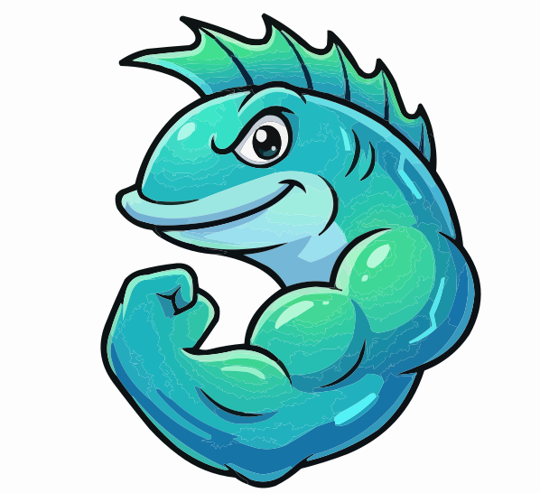

# 🐟 Suru - Mascota Oficial de AIQUAA

<div align="center">
  

  <h3>El surubí más tech del río Paraguay 🇵🇾</h3>

  []()
  []()
  []()
</div>

---

## 🎯 ¿Qué es Suru?

**Suru** es la mascota oficial de AIQUAA, un pez surubí estilizado que representa:
- 🇵🇾 El río Paraguay y nuestra identidad local
- 🧪 La excelencia en QA y testing
- 🤝 La comunidad tech paraguaya
- 💡 El aprendizaje continuo y la innovación

---

## 📚 Documentación Completa

| Documento | Descripción | Para quién |
|-----------|-------------|------------|
| **[SURU_DESIGN_SPEC.md](./SURU_DESIGN_SPEC.md)** | Especificación completa de diseño, anatomía, colores, poses | Diseñadores, PM |
| **[SURU_IMPLEMENTATION.md](./SURU_IMPLEMENTATION.md)** | Guía de uso de componentes React, ejemplos de código | Desarrolladores |
| **[SURU_BRIEF_FOR_DESIGNER.md](./SURU_BRIEF_FOR_DESIGNER.md)** | Brief detallado para contratar diseñador profesional | Freelancers, Agencias |

---

## ✅ Estado Actual (v1.0)

### ✅ Completado
- [x] Especificación de diseño completa
- [x] Paleta de colores definida
- [x] SVG conceptual base (`suru-welcome.svg`, `suru-logo.svg`)
- [x] Componentes React (SuruMascot, SuruOnboarding, SuruFloating)
- [x] Sistema de animaciones CSS
- [x] Traducciones ES/EN
- [x] Documentación técnica completa
- [x] Brief para diseñador profesional

### ⏳ Pendiente
- [ ] 13 poses adicionales (requiere diseñador profesional)
- [ ] Animaciones Lottie (opcional)
- [ ] Stickers para redes sociales
- [ ] Versión 3D (futuro lejano)

---

## 🎨 Poses Disponibles

| Pose | Estado | Uso Principal |
|------|--------|---------------|
| `welcome` | ✅ Concepto | Homepage, onboarding |
| `logo` | ✅ Concepto | Logo, favicon |
| `avatar` | ⏳ Pendiente | Avatares, perfiles |
| `chibi` | ⏳ Pendiente | Stickers, reacciones |
| `explaining` | ⏳ Pendiente | Tooltips, ayuda |
| `checklist` | ⏳ Pendiente | Tareas, validaciones |
| `teacher` | ⏳ Pendiente | ISTQB, cursos |
| `automator` | ⏳ Pendiente | Automatización |
| `explorer` | ⏳ Pendiente | Testing exploratorio |
| `performance` | ⏳ Pendiente | Performance testing |
| `loading` | ⏳ Pendiente | Estados de carga |
| `success` | ⏳ Pendiente | Éxito, aprobado |
| `404` | ⏳ Pendiente | Página no encontrada |
| `error` | ⏳ Pendiente | Errores, problemas |
| `thinking` | ⏳ Pendiente | Procesando, pensando |

---

## 🚀 Quick Start (Para Desarrolladores)

### 1. Instalar (Ya incluido en el proyecto)

Los componentes ya están en `apps/frontend/src/components/Suru/`

### 2. Importar CSS de Animaciones

En tu `layout.tsx` o `globals.css`:

```tsx
import '@/styles/suru-animations.css';
```

### 3. Usar Suru en tu Página

```tsx
import { SuruMascot } from '@/components/Suru';

export default function MyPage() {
  return (
    <div>
      <SuruMascot
        pose="welcome"
        size="medium"
        animated
        message="¡Hola! Soy Suru"
      />
    </div>
  );
}
```

### 4. Ver Ejemplos Completos

Revisa [SURU_IMPLEMENTATION.md](./SURU_IMPLEMENTATION.md) para 10+ ejemplos de uso.

---

## 🎨 Para Diseñadores

### ¿Quieres contribuir?

Necesitamos ayuda para crear las 13 poses faltantes de Suru. Lee el brief completo:

👉 **[SURU_BRIEF_FOR_DESIGNER.md](./SURU_BRIEF_FOR_DESIGNER.md)**

### Requisitos
- ✅ Experiencia con diseño vectorial (Figma/Illustrator/Affinity)
- ✅ Portfolio con mascotas/personajes
- ✅ Conocimiento de SVG optimizado
- ✅ (Opcional) Experiencia con animación Lottie/Rive

### Contacto
Abre un Issue en GitHub o contacta a: [email del proyecto]

---

## 📦 Estructura de Archivos

```
/
├── docs/design/
│   ├── SURU_README.md                    # ← Estás aquí
│   ├── SURU_DESIGN_SPEC.md               # Especificación completa
│   ├── SURU_IMPLEMENTATION.md            # Guía de implementación
│   └── SURU_BRIEF_FOR_DESIGNER.md        # Brief para diseñadores
│
├── apps/frontend/src/
│   ├── components/Suru/
│   │   ├── SuruMascot.tsx                # ✅ Componente principal
│   │   ├── SuruOnboarding.tsx            # ✅ Onboarding interactivo
│   │   ├── SuruFloating.tsx              # ✅ Mascota flotante
│   │   └── index.ts                      # ✅ Exports
│   │
│   ├── styles/
│   │   └── suru-animations.css           # ✅ Animaciones CSS
│   │
│   └── contexts/
│       └── LanguageContext.tsx           # ✅ Traducciones ES/EN
│
└── public/images/suru/
    ├── suru-welcome.svg                  # ✅ SVG conceptual
    ├── suru-logo.svg                     # ✅ SVG conceptual
    └── (13 poses más - pendientes)
```

---

## 🎯 Casos de Uso

### 1. Homepage - Bienvenida
```tsx
<SuruMascot pose="welcome" size="hero" animated />
```

### 2. Onboarding de Usuarios
```tsx
<SuruOnboarding onComplete={() => console.log('Done!')} />
```

### 3. Asistente Flotante
```tsx
<SuruFloating
  position="bottom-right"
  showOnPages={['/', '/labs']}
/>
```

### 4. Estados de Carga
```tsx
<SuruMascot pose="loading" size="medium" animated message="Cargando..." />
```

### 5. Página 404
```tsx
<SuruMascot pose="404" size="large" message="¡Ups! Página perdida" />
```

Más ejemplos en [SURU_IMPLEMENTATION.md](./SURU_IMPLEMENTATION.md)

---

## 🌈 Paleta de Colores

```css
--suru-primary: #0EA5E9      /* Cyan 500 - Cuerpo */
--suru-secondary: #06B6D4     /* Cyan 600 - Detalles */
--suru-accent: #10B981        /* Emerald 500 - Aletas */
--suru-tech: #6366F1          /* Indigo 500 - Tech */
--suru-highlight: #F0FDFA     /* Cyan 50 - Brillos */
--suru-shadow: #164E63        /* Cyan 900 - Sombras */
```

---

## 🤝 Contribuir

### Reportar Bugs
Abre un Issue con:
- 🐛 Descripción del problema
- 📸 Screenshot si es visual
- 💻 Código para reproducir

### Sugerir Mejoras
¿Ideas para nuevas poses o funcionalidades de Suru?
- 💡 Abre un Issue con tag `enhancement`
- 🎨 Adjunta bocetos/referencias

### Pull Requests
1. Fork el repositorio
2. Crea una rama: `git checkout -b feature/suru-nueva-pose`
3. Commit: `git commit -m 'feat: add suru celebration pose'`
4. Push: `git push origin feature/suru-nueva-pose`
5. Abre un PR

---

## 📊 Roadmap

### Fase 1: Concepto ✅ (Completado)
- [x] Especificación de diseño
- [x] SVG conceptual base
- [x] Componentes React
- [x] Documentación

### Fase 2: Diseño Profesional ⏳ (En progreso)
- [ ] Contratar diseñador
- [ ] 15 poses completas en SVG
- [ ] Variantes dark mode
- [ ] Optimización

### Fase 3: Animaciones 📅 (Q1 2025)
- [ ] Animaciones Lottie básicas
- [ ] Interactividad avanzada
- [ ] Animaciones condicionales

### Fase 4: Expansión 📅 (Q2 2025)
- [ ] Stickers para Discord/Telegram/WhatsApp
- [ ] Versión mini para badges
- [ ] Suru en diferentes contextos (festividades, eventos)

### Fase 5: Comunidad 📅 (Futuro)
- [ ] Concurso de fan art
- [ ] Suru en 3D (Three.js)
- [ ] Voice lines (opcional)

---

## 📜 Licencia y Créditos

### Licencia
Este proyecto es parte de AIQUAA, distribuido bajo licencia [MIT/Open Source].

### Créditos
- **Concepto y Diseño**: AIQUAA Team
- **Diseño Profesional**: [Pendiente - Nombre del diseñador]
- **Desarrollo**: AIQUAA Dev Team
- **Inspiración**: El río Paraguay y la comunidad QA 🇵🇾

### Uso de Suru
Suru es la mascota oficial de AIQUAA. Puedes usar los assets de Suru en:
- ✅ Proyectos personales de aprendizaje
- ✅ Presentaciones sobre QA
- ✅ Artículos/blogs mencionando AIQUAA
- ✅ Fan art (con crédito)

Por favor:
- ❌ No uses Suru para representar otra marca
- ❌ No vendas merchandise de Suru sin permiso
- ❌ No modifiques el diseño oficial sin aprobación

---

## 🙋 FAQ

**P: ¿Por qué un surubí?**
R: El surubí es un pez icónico del río Paraguay. Representa nuestra identidad local y el espíritu de AIQUAA: grande, fuerte, y nativo de Paraguay.

**P: ¿Por qué "Suru"?**
R: Es un apócope de "surubí" y suena amigable, fácil de recordar en cualquier idioma.

**P: ¿Puedo usar Suru en mi proyecto?**
R: Sí, siempre que des crédito a AIQUAA y no sea para fines comerciales. Ver sección Licencia.

**P: ¿Cómo puedo ayudar con el diseño?**
R: Lee el [SURU_BRIEF_FOR_DESIGNER.md](./SURU_BRIEF_FOR_DESIGNER.md) y contáctanos.

**P: ¿Habrá merchandise de Suru?**
R: ¡Esperamos que sí! Stickers, camisetas, y más están en el roadmap.

---

## 📞 Contacto

- **GitHub Issues**: Para bugs y sugerencias
- **Discord**: [Canal de AIQUAA]
- **Email**: [email del proyecto]
- **Twitter/X**: [@aiquaa_py]

---

<div align="center">
  <h3>Hecho con 💙 en Paraguay 🇵🇾</h3>
  <p><strong>Suru</strong> - Tu compañero en el mundo del QA</p>

  
</div>
